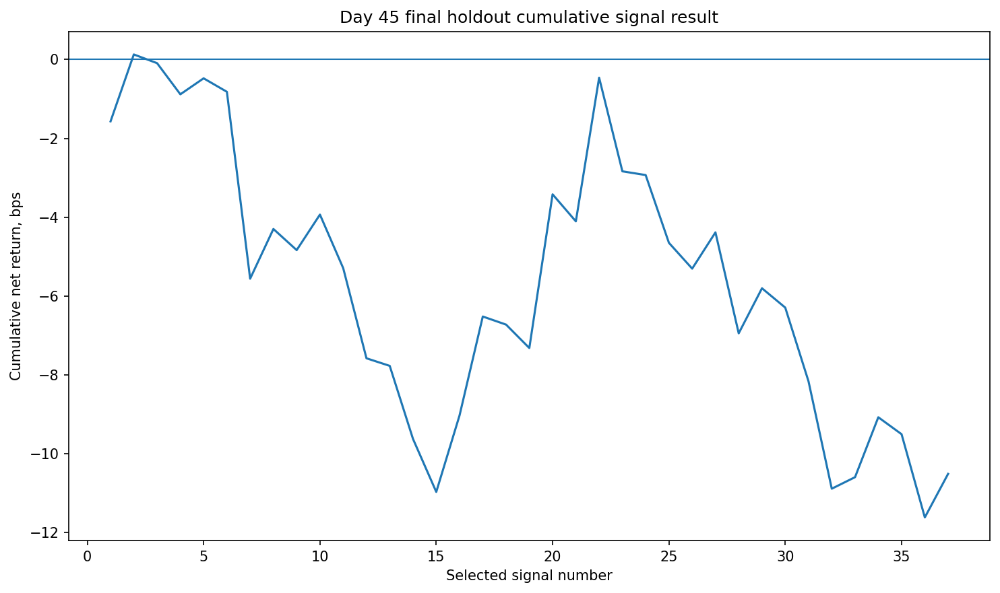
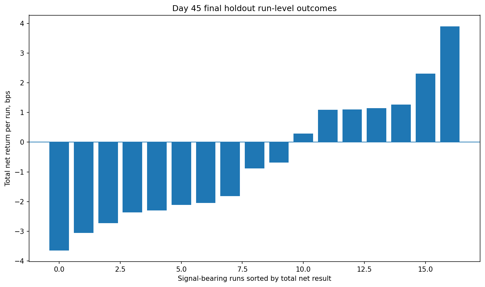
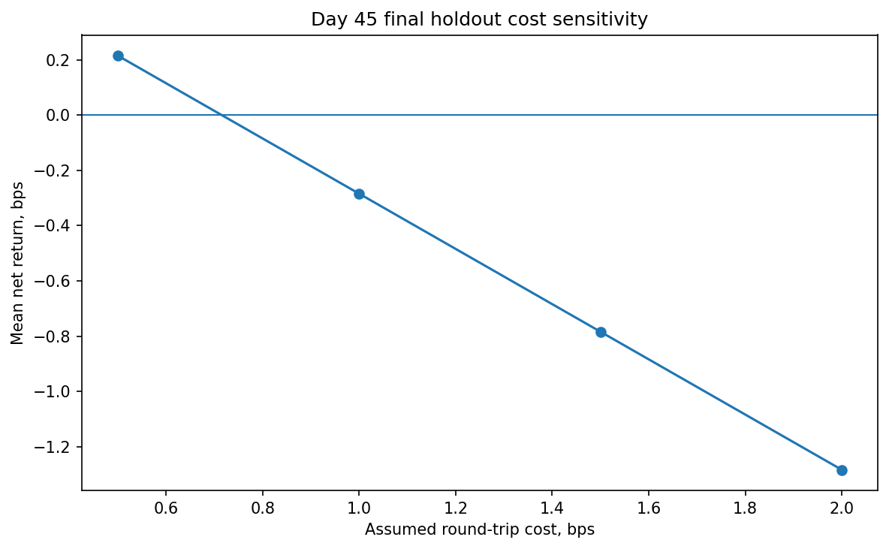

# Crypto Perpetual Futures Microstructure Lab

An end-to-end empirical study of short-horizon BTCUSDT perpetual-futures price prediction using reconstructed limit-order-book and trade-flow data.

## Project status

The main model-development cycle is complete.

The final specification was frozen before collecting a new independent holdout and was evaluated once without post-hoc changes to the model, features, thresholds, direction policy, timing window, cost assumption, or execution rule.

## Executive summary

This project investigates whether short-horizon information in the BTCUSDT perpetual-futures order book and trade flow can predict economically meaningful price movements.

The project covers the complete quantitative research pipeline:

- raw Binance market-data collection;
- depth snapshot and incremental-update handling;
- limit-order-book reconstruction;
- top-of-book and trade-flow feature engineering;
- chronological model validation;
- transaction-cost-aware signal evaluation;
- run-level robustness analysis;
- preregistration and frozen holdout testing.

The main empirical finding is that reduced order-book features contain transferable short-horizon directional information. On the final independent holdout, the direction model achieved a ROC-AUC of **0.716**, balanced accuracy of **0.663**, and selected-signal directional precision of **67.6%**.

However, predictive accuracy did not translate into robust profitability under the preregistered **1 bps round-trip cost**. The final policy generated an average gross return of **0.716 bps** and an average net return of **−0.284 bps**.

> Predictive signal transferred, but robust economic profitability after transaction costs was not demonstrated.

## Research question

Can BTCUSDT perpetual-futures order-book and trade-flow features predict:

1. whether a meaningful short-horizon price movement will occur;
2. the direction of that movement;
3. and whether the resulting signal is large enough to survive transaction costs?

## Why this project matters

A model can predict direction better than random and still fail as a trading strategy.

Economic performance depends not only on classification accuracy, but also on:

- the magnitude of correctly predicted moves;
- the size of adverse directional errors;
- signal frequency;
- execution timing;
- spreads, fees and slippage;
- stability across days and market regimes.

This project therefore separates **predictive performance** from **economic tradability**.

## Data

- **Instrument:** BTCUSDT perpetual futures
- **Source:** Binance USD-M Futures
- **Raw inputs:** depth snapshots, incremental depth updates and aggregate trades
- **Primary sampling regime:** weekday active hours, approximately 14:00–17:00 UTC
- **Observation unit:** reconstructed top-of-book event
- **Final prediction horizon:** 50 book events
- **Meaningful-move threshold:** absolute future return above 1 bps

Raw and processed market datasets are excluded from Git because of file size. The repository contains the collection, reconstruction, feature-engineering and evaluation code, together with the final result tables, figures and research reports.

## Research pipeline

```text
Binance REST snapshot
        +
Binance depth stream
        +
Aggregate trades
        |
        v
Raw run folders
        |
        v
Limit-order-book reconstruction
        |
        v
Top-of-book event series
        |
        v
Book and trade-flow features
        |
        v
Chronological model development
        |
        v
Frozen specification
        |
        v
Independent final holdout
        |
        v
Cost-aware and run-level evaluation
```

## Modelling framework

The final model uses a two-stage design.

### Stage 1: MOVE model

The MOVE model estimates whether the absolute future return exceeds the 1 bps dead zone.

- Model: logistic regression
- Feature set: 24 medium trade-flow features
- Regularization: `C = 0.03`
- Decision threshold: `0.65`

### Stage 2: direction model

The direction model predicts UP versus DOWN conditional on a meaningful movement.

- Model: logistic regression
- Feature set: 8 reduced order-book features
- Regularization: `C = 1.0`
- Decision threshold: `0.65`

### Frozen execution policy

- Horizon: 50 book events
- Entry rule: first eligible signal
- Cooldown: 50 events
- Directions: LONG and SHORT retained
- Primary round-trip cost: 1 bps
- No post-hoc threshold or direction changes after holdout inspection

## Validation design

Random shuffling is inappropriate for this problem because financial observations are time-ordered and market regimes change.

The project therefore uses:

- chronological train, validation and test splits;
- multiple weekday out-of-sample folds;
- validation-only threshold selection;
- strict technical data-quality rules;
- run-level aggregation;
- leave-one-run-out robustness checks;
- run-cluster bootstrap confidence intervals;
- a separately collected final holdout after model freeze.

## Chronological development evidence

| Sample | Signals | Signal-bearing runs | Directional precision | Mean gross, bps | Mean net after 1 bps, bps |
|---|---:|---:|---:|---:|---:|
| Tuesday → Wednesday | 46 | 17 | 56.5% | 1.102 | 0.102 |
| Tuesday–Wednesday → Thursday | 61 | 20 | 68.9% | 1.723 | 0.723 |
| Tuesday–Thursday → Friday | 118 | 31 | 63.6% | 0.786 | −0.214 |
| Pooled development OOS | 225 | 68 | 63.6% | 1.104 | 0.104 |

The pooled development result was slightly positive, but performance was fold-dependent and statistically uncertain. This motivated one final independent holdout rather than a profitability claim.

## Final independent holdout

The final model was frozen on Day 43. A new active-hours batch was collected afterward and evaluated once.

### Data quality

- Raw attempts: 36
- Successful raw runs: 36
- Successfully reconstructed runs: 36
- Strict eligible runs: 36
- Technical exclusions: 0
- Processed rows per run: 2,908–2,916

### Classifier diagnostics

| Stage | Feature set | Balanced accuracy | ROC-AUC | Average precision |
|---|---|---:|---:|---:|
| MOVE | Medium trade flow | 0.538 | 0.593 | 0.438 |
| Direction | Reduced order book | 0.663 | 0.716 | 0.694 |

### Frozen deployment result

| Metric | Final holdout |
|---|---:|
| Signals | 37 |
| Signal-bearing runs | 17 |
| Directional precision | 67.6% |
| Mean gross return | 0.716 bps |
| Mean net return after 1 bps | −0.284 bps |
| Median net return | −0.430 bps |
| Total net return | −10.513 bps |
| Positive-net signal share | 35.1% |
| Break-even round-trip cost | 0.716 bps |

The directional model generalized well, but the selected moves were not large enough on average to cover the preregistered 1 bps cost.

## Outcome decomposition

| Outcome | Signals | Total net result |
|---|---:|---:|
| Profitable after cost | 13 | +21.242 bps |
| Correct direction but below cost | 12 | −5.237 bps |
| Wrong direction | 12 | −26.517 bps |

The result was not caused by an absence of directional information. Many forecasts were correct, but some correct moves were too small to cover costs, while wrong-direction signals produced sufficiently large adverse losses to eliminate the profitable tail.

## Directional decomposition

| Direction | Signals | Directional precision | Mean gross | Mean net |
|---|---:|---:|---:|---:|
| DOWN / SHORT | 23 | 60.9% | 0.358 bps | −0.642 bps |
| UP / LONG | 14 | 78.6% | 1.304 bps | +0.304 bps |

The direction asymmetry reversed relative to development. This provides direct evidence against changing the strategy post hoc to a direction-only policy.

## Robustness

- Mean net without the best signal: **−0.400 bps**
- Mean net without the best run: **−0.400 bps**
- Leave-one-run-out range: **[−0.401, −0.196] bps**
- Run-cluster bootstrap 95% CI: **[−0.737, 0.191] bps**
- Positive bootstrap means: **11.6%**

All leave-one-run-out estimates remained negative, so the final result was not driven by one unusually bad run.

## Transaction-cost sensitivity

| Round-trip cost | Mean net return | Total net return |
|---:|---:|---:|
| 0.5 bps | +0.216 bps | +7.987 bps |
| 1.0 bps | −0.284 bps | −10.513 bps |
| 1.5 bps | −0.784 bps | −29.013 bps |
| 2.0 bps | −1.284 bps | −47.513 bps |

The policy had a positive point estimate under a 0.5 bps cost assumption, but the primary preregistered conclusion remains negative at 1 bps.

## Main conclusion

The project found:

- meaningful transferable directional information in reduced order-book features;
- weaker but non-random MOVE information in trade-flow features;
- substantial variation in economic performance across days;
- insufficient gross edge to robustly cover a 1 bps round-trip cost.

The final scientific conclusion is:

> The predictive model generalized, but the frozen execution policy did not demonstrate robust profitability after transaction costs.

## Key research lessons

1. Directional accuracy and economic profitability are different objectives.
2. Transaction costs can dominate a statistically meaningful predictive edge.
3. Chronological validation is essential for high-frequency financial data.
4. Direction-specific performance can reverse across market regimes.
5. A frozen holdout is more informative than additional post-hoc tuning.
6. A negative confirmatory result can still produce useful market-microstructure insight.

## Repository structure

```text
.
├── scripts/
│   ├── collect_raw.py
│   ├── collect_weekday_active_runs.py
│   ├── collect_final_holdout_runs.py
│   ├── inspect_raw_runs.py
│   ├── build_top_of_book.py
│   ├── build_top_of_book_all_runs.py
│   ├── build_basic_features_all_runs.py
│   ├── build_trade_flow_features.py
│   ├── evaluate_final_frozen_holdout.py
│   └── build_final_project_summary.py
│
├── reports/
│   ├── figures/
│   ├── tables/
│   ├── day43_final_holdout_preregistration.md
│   ├── day45_final_holdout_evaluation.md
│   └── day46_final_research_summary.md
│
├── data/
│   ├── raw/          # excluded from Git
│   └── processed/    # excluded from Git
│
├── requirements.txt
└── README.md
```

The exact repository may contain additional experiment and diagnostic scripts created during earlier research days.

## Selected final figures

### Final holdout cumulative result



### Run-level outcomes



### Transaction-cost sensitivity



## Reproducing the workflow

### 1. Clone the repository

```bash
git clone <repository-url>
cd crypto-perp-microstructure-lab
```

### 2. Create a virtual environment

On Windows PowerShell:

```powershell
python -m venv .venv
.venv\Scripts\python.exe -m pip install --upgrade pip
.venv\Scripts\python.exe -m pip install -r requirements.txt
```

Using `.venv\Scripts\python.exe` directly avoids depending on PowerShell's virtual-environment activation policy.

### 3. Collect raw market data

The repository includes collection scripts for Binance snapshots, depth updates and aggregate trades.

Example:

```powershell
.venv\Scripts\python.exe scripts\collect_raw.py
```

Collection parameters should be reviewed before execution. Historical project results depend on the specific batches documented in the research reports.

### 4. Reconstruct the order book

```powershell
.venv\Scripts\python.exe scripts\build_top_of_book_all_runs.py
```

### 5. Build book features

```powershell
.venv\Scripts\python.exe scripts\build_basic_features_all_runs.py
```

### 6. Build trade-flow features

```powershell
.venv\Scripts\python.exe scripts\build_trade_flow_features.py
```

### 7. Build the final research summary

```powershell
.venv\Scripts\python.exe scripts\build_final_project_summary.py
```

### Important reproducibility note

The original final holdout evaluation was a one-time frozen confirmatory test. Re-running the evaluator can reproduce the computation on the same local data, but it does not create a new independent holdout.

## Reports

- [Final Research Summary](reports/day46_final_research_summary.md)
- [Final Frozen Holdout Evaluation](reports/day45_final_holdout_evaluation.md)
- [Final Holdout Preregistration](reports/day43_final_holdout_preregistration.md)

Machine-readable result tables are available in [`reports/tables`](reports/tables), and the final figures are available in [`reports/figures`](reports/figures).

## Limitations

- The final holdout covers one future active-hours weekday rather than many independent future days.
- The 1 bps transaction-cost assumption does not separately model maker/taker fees, spread crossing, latency, queue position, slippage and market impact.
- Event-time horizons vary in clock time as market activity changes.
- Logistic regression primarily captures linear relationships after preprocessing.
- The execution rule is evaluated on reconstructed historical data rather than in a live exchange simulator.
- Results are specific to BTCUSDT perpetual futures and the sampled market regimes.

## Future work

Any continuation should begin as a new, separately preregistered research cycle.

Scientifically appropriate directions include:

- magnitude-aware or tail-risk-aware prediction targets;
- explicit execution-cost and fill-probability modelling;
- several independent future holdout days;
- rolling retraining and calibration;
- predefined regime variables;
- live paper trading with latency and queue-position diagnostics.

These directions do not change the conclusion of the completed frozen cycle.

## Disclaimer

This repository is a research and educational project. It does not constitute investment advice and does not present the final model as a production-ready trading strategy.
